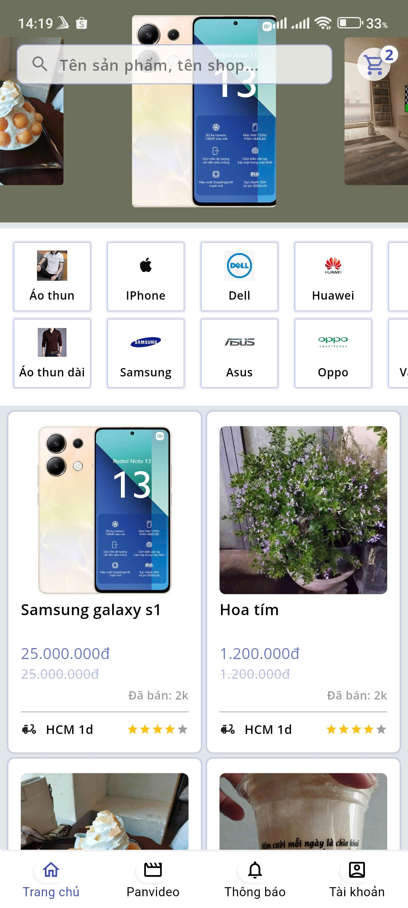
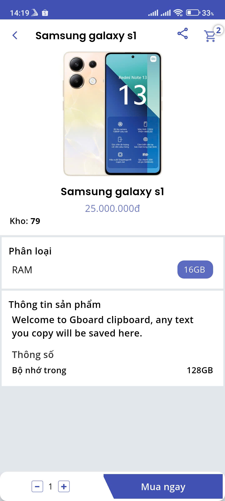
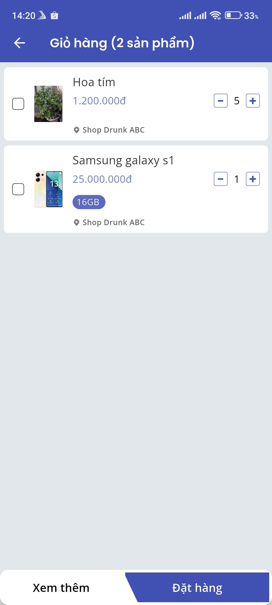
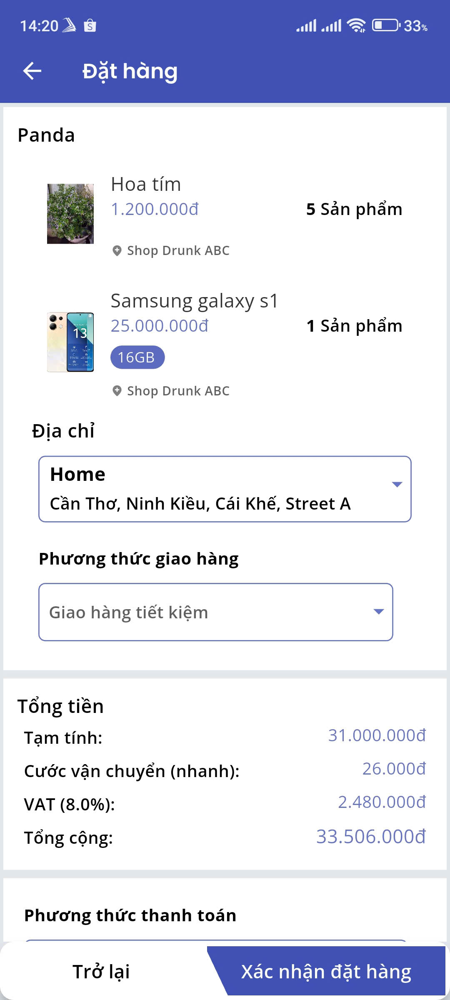
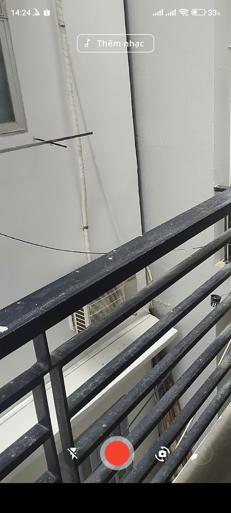
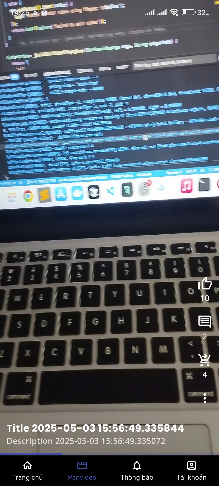
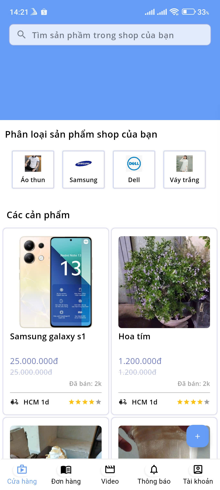
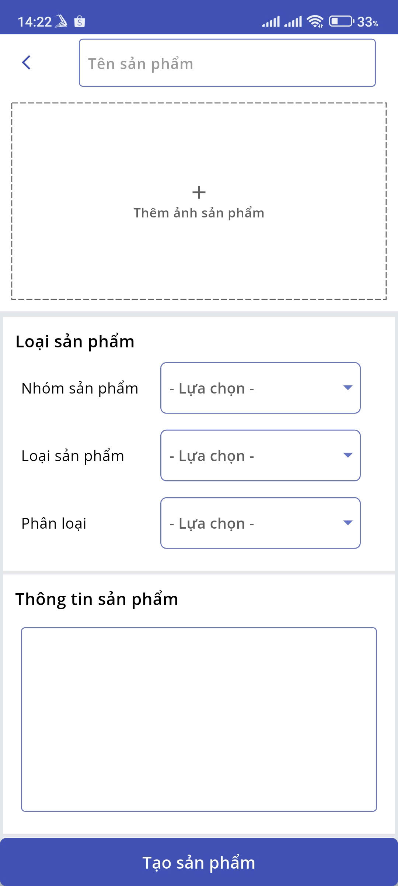

# PandaShop - E-Commerce App

A Flutter e-commerce application with short video features.
|  |  |  |  |
|-------------------------------------------|--------------------------------------------------|-----------------------------------------------|----------------------------------------------------|
|  |  |  |  |

## Features

### User features
- User authentication
- Product list & product searching
- Shopping cart functionality
- Place orders
- Notifications (FCM, SignalR)
- Panvideo (short videos)

### Shop Features
- Order management 
- Product creation
- Panvideo creation
- Driver tracking on map (here_map)

### Panvideo features
- Video content creation (camerawesome)
- Music integration (just_audio, ffmpeg_kit_flutter)
- Video thumbnails (video_thumbnail)
- Custom video player (awesome_video_player)

### Others
- Multi-language support (easy_localization)
- Responsive UI (flutter_screenutil)

## Project Structure

```
lib/
├── core/                  # Core utilities and base classes
├── src/
│   ├── config/           # App configuration
│   │   ├── di/          # Dependency injection
│   │   └── theme/       # App theming
│   └── features/        # Feature modules
│       ├── product/     
│       ├── panvideo/    
│       ├── notification/
│       └── common/      
```

## State Management

The app uses BLoC (Business Logic Component) pattern for state management with the following packages:
- `flutter_bloc`: Main state management solution
- `get_it`: Dependency injection
- `injectable`: Code generation for dependency injection

### Some BLoC Components:
- CreatePanVideoBloc: Handles video creation
- PanMusicPlayerBloc: Manages audio playback
- SignalRBloc: Manages real-time notifications

## Dependencies

### Core
- `flutter_bloc`: ^8.1.1
- `get_it`: ^7.2.0
- `dio`: ^5.0.0 (HTTP client)
- `retrofit`: ">=4.0.0 <5.0.0" (API integration)

### UI/UX
- `flutter_screenutil`: ^5.7.0
- `extended_image`: ^9.1.0
- `flutter_svg`: ^2.0.10+1

### Media (panvideo)
- `camerawesome`: ^2.3.0
- `just_audio`: ^0.10.1
- `ffmpeg_kit_flutter`: Custom fork for video editing

## Getting Started


## APIs
You need to run the APIs on [PandaShop API repo](https://github.com/dttrung-99931/PandaShopBackEnd) using ASP.NET core


## Clone & setup source

1. Clone the repository:
```bash
git clone https://github.com/dttrung-99931/PandaShopFlutter.git
```

2. Install dependencies:
```bash
flutter pub get
```

3. Run code generation:
```bash
flutter pub run build_runner build -d
```

4. Run the app:
```bash
flutter run --flavor {flavor_name}  
```

## Environment Setup

The app uses different environment configurations managed by `flutter_dotenv`:

```bash
# Create environment file
cp assets/env/.env.example assets/env/.env
```

## Font Configuration

The app uses custom fonts:
- Poppins (Light, Regular, SemiBold, Bold)
- OpenSans (Light, Regular, SemiBold, Bold)

## Contributing

1. Fork the repository
2. Create your feature branch
3. Commit your changes
4. Push to the branch
5. Create a Pull Request

## License

This project is licensed under the MIT License - see the LICENSE file for details

